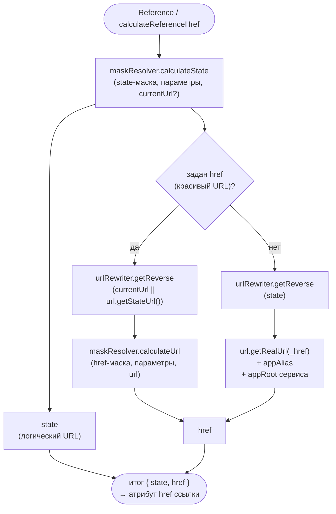
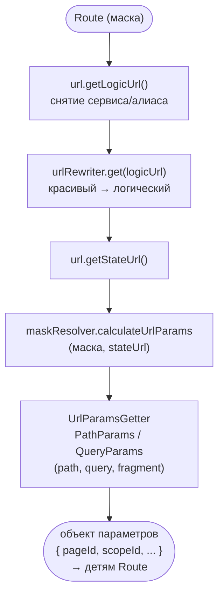
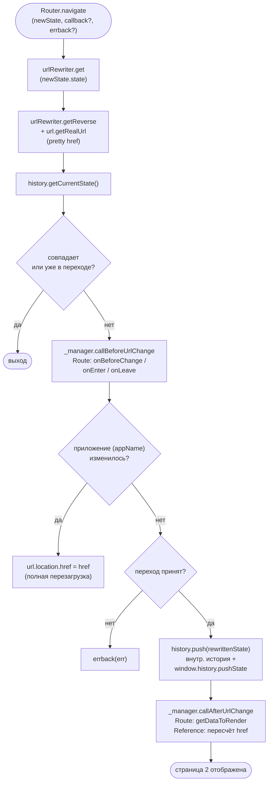
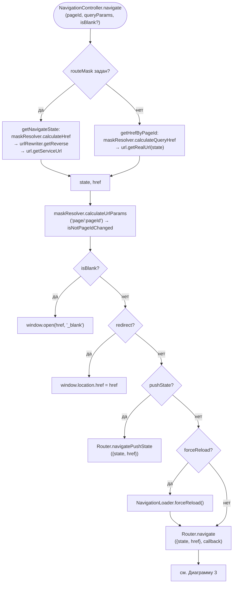
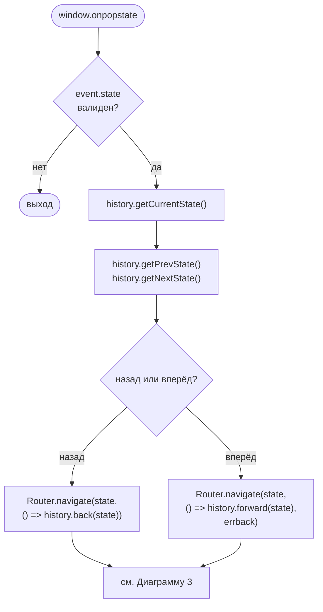
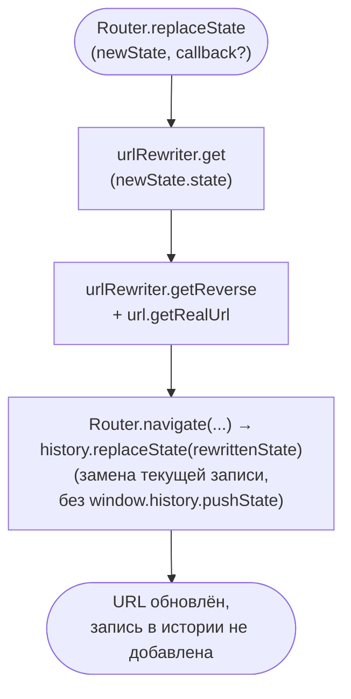
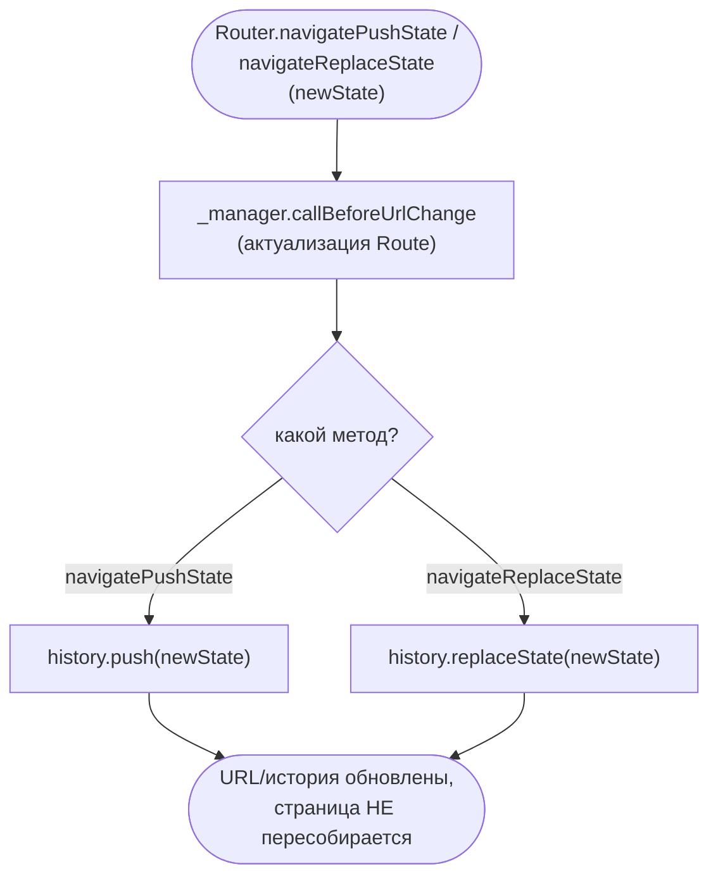
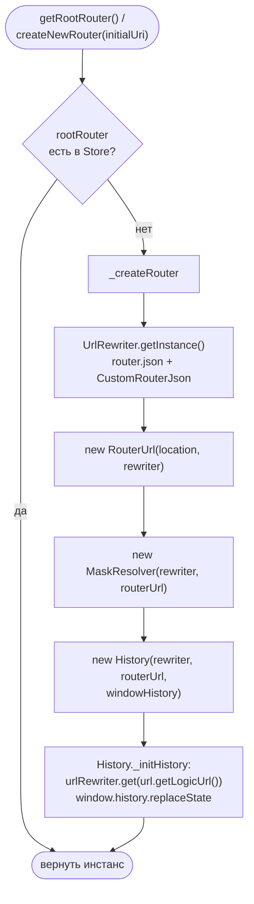
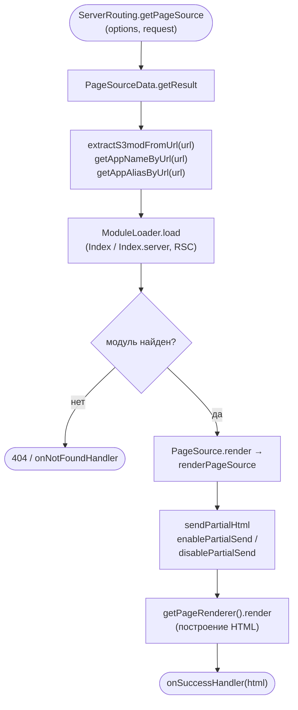
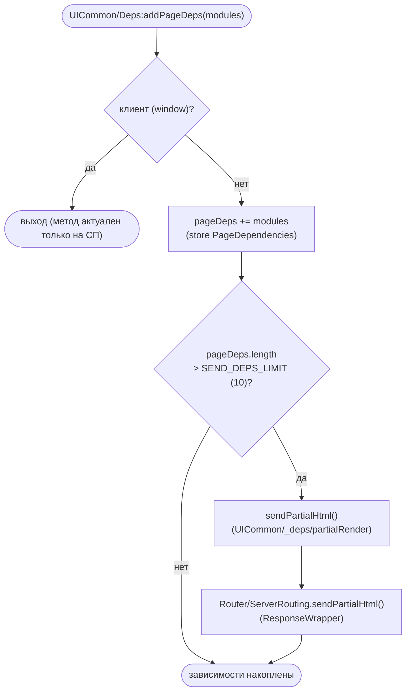

# UML-схемы бизнес-процессов работы с роутером

На схемах отражены только вызовы публичного API роутера:

- `Router/router:MaskResolver`
- `Router/router:UrlRewriter`
- `Router/router:Router.navigate`
- `Router/router:Router.history`

Плюс `Router/router:Router.url` (`IRouterUrl`) — именно через него учитываются сторонние сервисы
(`appRoot`/`appAlias`).

## Сводка процессов

| # | Процесс | Публичные вызовы |
|---|---------|------------------|
| 1 | Построение URL для ссылки | `maskResolver.calculateState/calculateUrl`, `urlRewriter.getReverse`, `url.getRealUrl` |
| 2 | Разбор параметров из URL | `urlRewriter.get`, `url.getLogicUrl`, `maskResolver.calculateUrlParams` |
| 3 | SPA-переход страница 1 → страница 2 | `Router.navigate`, `history.getCurrentState`, `history.push` |
| 4 | SPA pagex-переход | `NavigationController.navigate` → `Router.navigate` |
| 5 | Переход по кнопкам браузера назад/вперёд | `history.getCurrentState/getPrevState/getNextState`, `history.back/forward`, `Router.navigate` |
| 6 | Переход без новой записи в истории | `Router.replaceState`, `history.replaceState` |
| 7 | Смена URL без перестроения страницы | `Router.navigatePushState`/`navigateReplaceState`, `history.push`/`replaceState` |
| 8 | Инициализация роутера / стартовый URL | `getRootRouter`/`createNewRouter`, `UrlRewriter.getInstance`, `history` (инициализация) |
| 9 | Построение страницы на сервере (SSR) | `extractS3modFromUrl`/`getAppNameByUrl`, `sendPartialHtml`, `enablePartialSend`/`disablePartialSend` |
| 10 | Отправка частичного HTML при сборе зависимостей | `UICommon/Deps:addPageDeps` → `sendPartialHtml` |

---

# Блок A. Клиентские процессы (SPA)

## 1. Построение URL для ссылки (с учётом сторонних сервисов)

Источник: `Router/_private/Reference.tsx` → `Router/_private/shared/calculateReferenceHref.ts`.

## 2. Разбор параметров из URL (с учётом сторонних сервисов)

Источник: `Router/_private/Route.tsx` (`_applyNewUrl`/`_checkUrlResolved`) →
`Router/_private/MaskResolver.ts` (`calculateUrlParams`).

## 3. SPA-переход со страницы 1 на страницу 2 (`Router.navigate`)

Источник: `Router/_private/Router/Router.ts` (`navigate`, `_tryApplyNewState`),
`Router/_private/Router/RouterManager.ts`, `Router/_private/History.ts`.

## 4. SPA pagex-переход (`NavigationController.navigate` → `Router.navigate`)

Источник: `engine-saby-page/client/Page/_base/NavigationController.ts` (`navigate`).

## 5. Переход по кнопкам браузера «назад/вперёд» (popstate)

Источник: `Router/_private/Router/InitOnPopState.ts`, `Router/_private/History.ts` (`back`/`forward`).

## 6. Переход без новой записи в истории (`Router.replaceState`)

Источник: `Router/_private/Router/Router.ts` (`replaceState`), `Router/_private/History.ts` (`replaceState`).

## 7. Смена URL без перестроения страницы

Источник: `Router/_private/Router/Router.ts` (`navigatePushState`, `navigateReplaceState`).

## 8. Инициализация роутера / разбор начального URL

Источник: `Router/_private/Router/Router.ts` (`getRootRouter`, `createNewRouter`, `_createRouter`),
`Router/_private/History.ts` (`_initHistory`).

---

# Блок B. Серверные процессы (SSR)

## 9. Построение страницы на сервере по URL

Источник: `Router/ServerRouting.ts` (`getPageSource`),
`Router/_ServerRouting/PageSourceData.ts`, `Router/_ServerRouting/ModuleLoader.ts`,
`Router/_ServerRouting/PageSource.ts`, `Router/_private/MaskResolver.ts`
(`extractS3modFromUrl`, `getAppNameByUrl`).

## 10. Отправка частичного HTML при сборе зависимостей страницы

`UICommon/Deps:addPageDeps` (модуль `UICommon/_deps/PageDependencies.ts`) в процессе построения
страницы накапливает зависимости. При превышении лимита `SEND_DEPS_LIMIT = 10` вызывает
`sendPartialHtml`, который форвардит в `Router/ServerRouting.sendPartialHtml`
(`UICommon/_deps/partialRender.ts` → `Router/_ServerRouting/ResponseWrapper.ts`).

## Сноска

Deprecated-обёртки `Controller.navigate`/`replaceState`, `Data`, `History`, `MaskResolver`,
`UrlRewriter` (`Router/_private/_deprecated/*`) лишь форвардят вызовы в `getRootRouter()` и
покрываются схемами 3 и 6.
